# July 20 pre-release audit

Use as the implementation backlog. Inspect the repo before changing code; preserve current features unless an item says otherwise. Complete an item only after implementation and relevant tests. `AA` = WCAG 2.1 AA. Current URL: `https://nhl-trade-machine.vercel.app`; planned canonical domain: `hockeyledger.io`. Ensure notes are published in devnotes.md.

## 0. Release priority

- [ ] **F0 (v1 shipped, workshop pending) — Fantasy Hockey Tools:** build, workshop, and test this page first. The season starts in <70 days; it must be strong enough to make Hockey Ledger a primary fantasy research tool. On `/`, make it Feature 3 using the Feature 1/2 design.

## 1. Global

- [ ] **G1 — Navigation:** use the shared Header and Footer on every subpage. Exception: `/`, whose own navigation is intentional.
- [x] **G2 — Naming:** remove all `™` marks (`STRAND™` → `STRAND`, `GRAVITY™` → `GRAVITY`). Reconcile `NAV` vs `X-NAV`; one name and definition must be used everywhere. Current conflicting copy: NAV is separately defined in “How the Engine Works” and “Player Valuation”; X-NAV is described as the skater model. 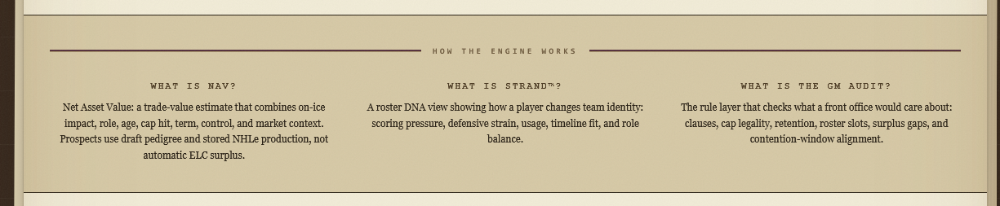 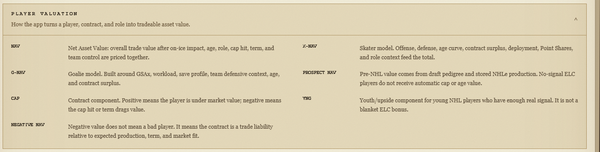
- [ ] **G3 — Icons:** use one icon system across all pages; document every icon in the Icon Key. Re-establish rules for flags such as Injury History and Shutdown.
- [ ] **G4 — Model propagation:** changes to EDGE, GRAVITY, roles, and data models must propagate through X-NAV, NOIV, and the built-in three-year Simulation Engine.

## 2. Home `/`

- [x] **H1 — Hero:** move the final scroll-animation resting position upward so the full “The Hockey Ledger” heading remains visible. 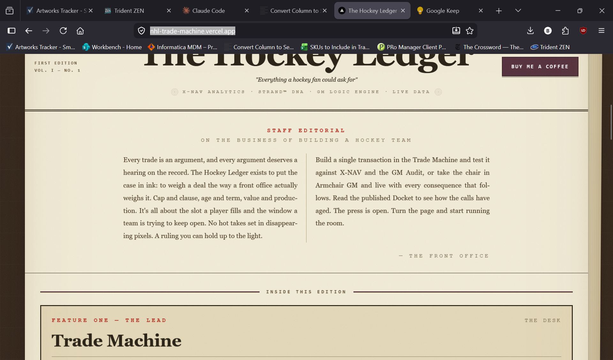
- [x] **H2 — Staff Editorial:** replace its paragraph with: “Build your trade in the Trade Machine and test it against the X-NAV engine and the GM Audit or take the chair in Armchair GM and live with every consequence that follows. Explore advanced and enhanced stats on the Player Analytics page, featuring the Hockey Ledger exclusive Player Gravity system, STRAND DNA Identity profiles and a new all-in-one X-NAV model. Read the published Docket to see how the calls have aged. Visit the Press Box and play the daily hockey crib.” Put “The press is open. Turn the page and start running the room.” below it, centered and styled like “On the Business of Building a Hockey Team.” 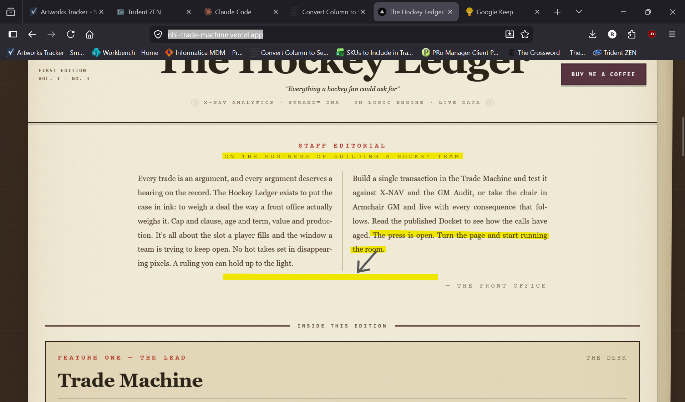
- [ ] **H3 — Highest-Valued Assets:** retain the component; make it AA.
- [ ] **H4 — Engine content:** retain the readable NAV/STRAND/GM Audit presentation, update it for current logic, and apply G2.
- [ ] **H5 — Icon Key:** make it AA and easier to scan; include every icon. Tabs by system are acceptable (for example, STRAND and GRAVITY). 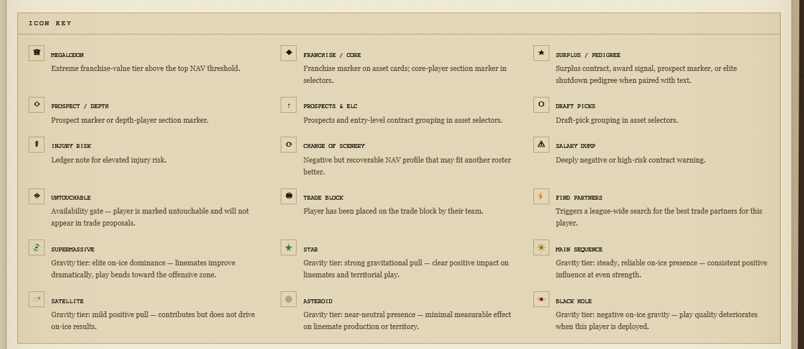
- [ ] **H6 — Player Valuation:** make it AA and verify every definition against current code/model behavior. 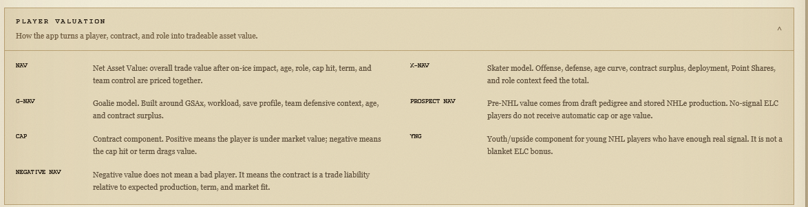
- [ ] **H7 — STRAND glossary:** move it to `/glossary`; verify it against the current EDGE API-backed system. 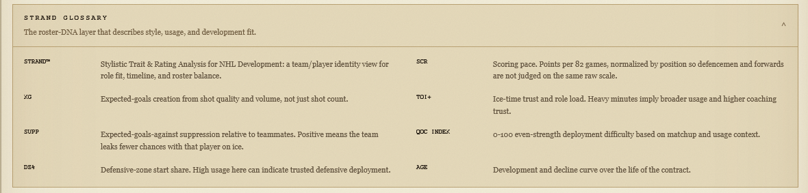
- [ ] **H8 — Trade Logic:** make it AA; verify against current logic/model and rewrite any mismatch. 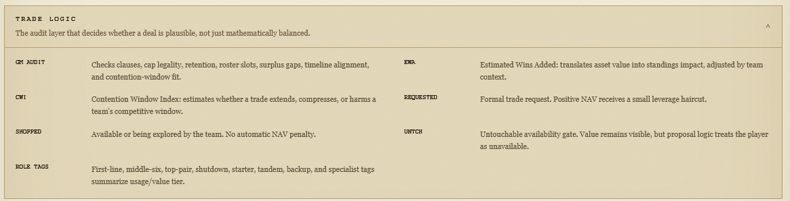
- [ ] **H9 — Data Sources:** make it AA; add sincere acknowledgements and active links to every source’s homepage. 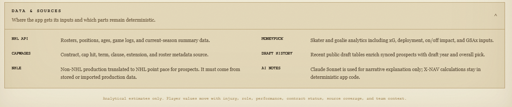
- [ ] **H10 — Information architecture:** reduce Methodology/Glossary/Icon Key to two pages. `/methodology` = why/how the systems and technologies were created/used, plus Buy Me a Coffee CTA. `/glossary` = the current definitions, keys, and explanations (“what”), including current Methodology/STRAND content. 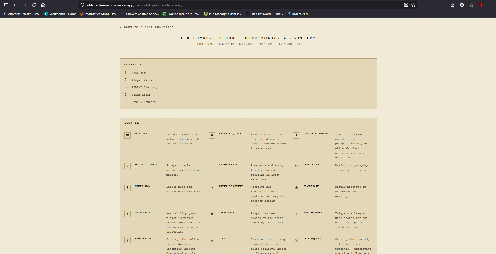 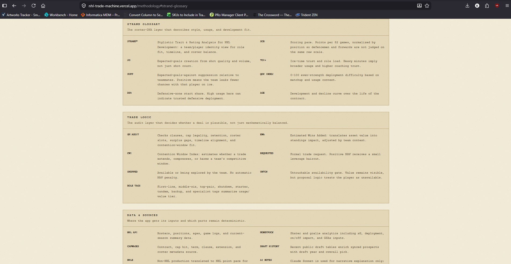

## 3. Header

- [x] **HD1 — Simplify:** remove `TRADE EDITION`, `X-NAV Analytics`, `Trade Machine`, `Armchair GM`, and `Live Statistics`. Keep `EST. 2026 — VOL. I — {date/data status}` below the title. Status can be `Data Online`, `Data updated {date}`, or `{day} / {month} Data Online`. 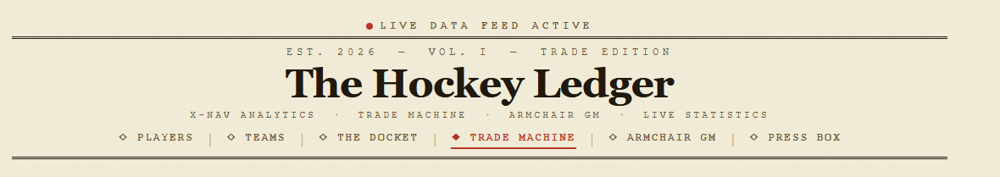

## 4. Trade Machine `/trade-machine`

- [ ] **TM1 — Phase 3 picker:** replace team dropdown/outgoing-asset UX with a visual roster grid and drag-to-trade-block; select team before player (no global alphabetical player list); add side-by-side roster impact; use a performance endpoint for faster loading.
- [x] **TM2 — Current assets:** disallow all 2026 draft picks. Drive assets from the latest daily data.
- [ ] **TM3 — Layout:** make asset blocks internally scrollable so their size stays fixed. Move GM Logic Signal outside the “Team Sending Assets” div, between Cap in Play and Team STRANDs. Add goaltending metrics to Team STRANDs; a goalie acquisition must not appear as only an OFF/DEF decline.
- [ ] **TM4 — Feedback/share:** fix Generate Share Link. Show a progress bar or percentage while loading teams/assets and EDGE data.
- [ ] **TM5 — GM Audit:** expand contextual reasoning using team needs, trajectory, timeline, roster redundancy, and the calibre/role of assets both ways. Example to test: receiving a franchise goalie plus second-line defenceman can justify moving a franchise defenceman; the current Bruins/McAvoy decision rejects solely because McAvoy cannot be lost, without adequately reasoning about goalie context (including Swayman). 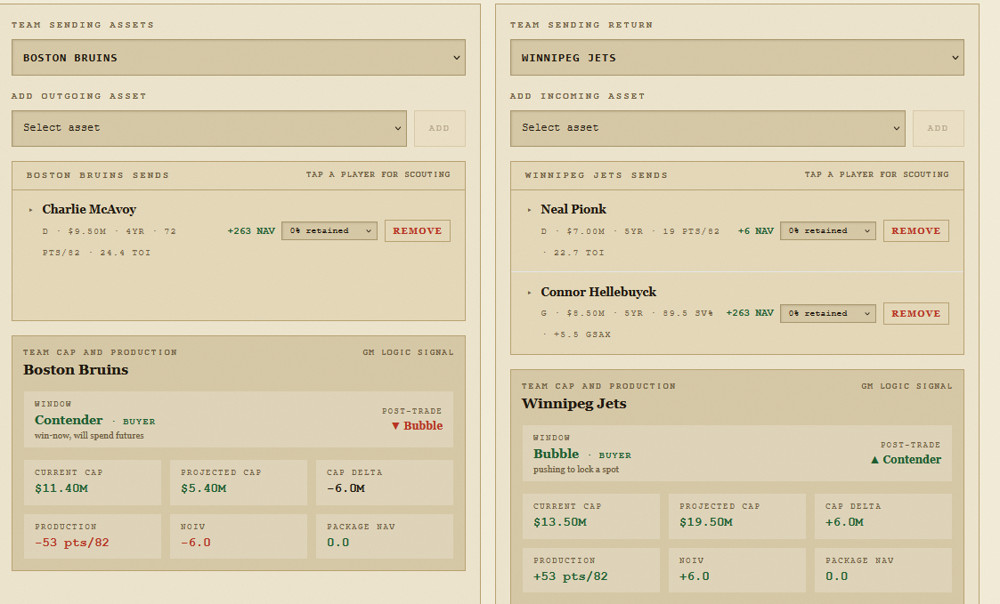 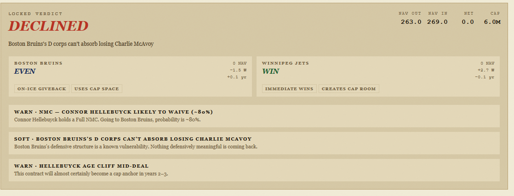
- [ ] **TM6 — Goalie value/team fit:** confirm a franchise goalie improves EWA and that fit flags are coherent. Test Jets–Ducks Hellebuyck for Hinds + Gauthier; determine whether both the decision and flags make sense. 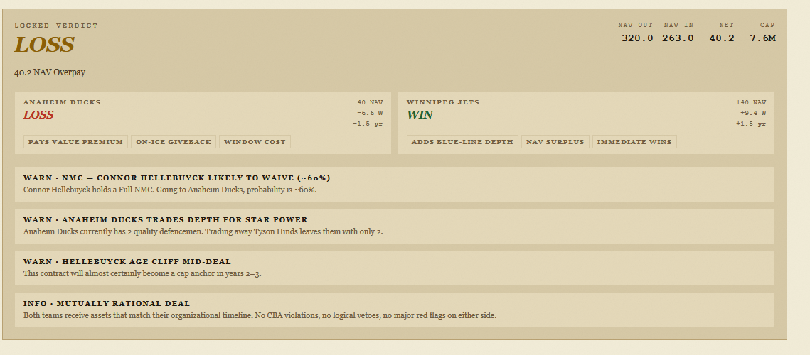
- [ ] **TM7 — Landing/accessibility:** rework “Build. Audit. Share.” and remove its Open Armchair GM CTA. Make the page AA.

## 5. Player Analytics `/players` and `/players/{nhlid}`

- [ ] **PA1 — Lighter index:** keep only basic data on `/players`. Replace `STATS | STRAND | PLAYER CARD | EDGE | GRAVITY | CONTRACT | OUTLOOK` with `STATS | CONTRACT | OUTLOOK | ADVANCED ANALYTICS`; Advanced Analytics opens `/players/{nhlid}`.
- [ ] **PA2 — Modern roles:** remove legacy roles such as Sniper/Two-Way Defenceman. Derive these from available data:
  - `Puck-Moving Anchor` — D; clean exits/controlled entries, rarely dumps.
  - `Neutral Zone Engine` — F; carries through neutral ice for controlled entries.
  - `High-Danger Distributor` — seeks cross-seam/low-to-high passes for high-probability chances.
  - `Rush Weapon` — counterattack specialist using speed/tracking on odd-man rushes.
  - `Slot Hunter` — off-puck movement into soft high-danger slot ice for quick shots/deflections.
  - `Net-Front Disruptor` — screens, tips, and low-slot rebounds.
  - `Volume Shooter` — drives offense by directing many pucks at net.
  - `Forecheck Monster` — offensive-zone recoveries/forced turnovers sustain possession.
  - `Perimeter Lockdown` — D; forces rushes outside and denies clean blue-line entries.
  - `Complete Shutdown` — C; suppresses opponents’ expected goals while on ice.
  - `Floor Raiser` — high usage; carries weak rosters via transition, minutes, and self-created offense.
  - `Ceiling Raiser` — adaptable elite complement; suppression, forechecking, or off-puck play elevates an elite line.
- [ ] **PA3 — Goalie EDGE:** extend roles/analysis to goalies. Base: `https://api-web.nhle.com/v1/edge/`. Use these unique source endpoints (source doc repeated several): `goalie-landing/20252026/2`; `goalie-shot-location-top-10/{shots-against|goals-against|save-pctg|saves}/all/20252026/2`; `goalie-shot-location-top-10/goals-against/high/20252026/2`.

### Tabs/components

- [ ] **PA4 — Stats:** retain; remove Contract content. 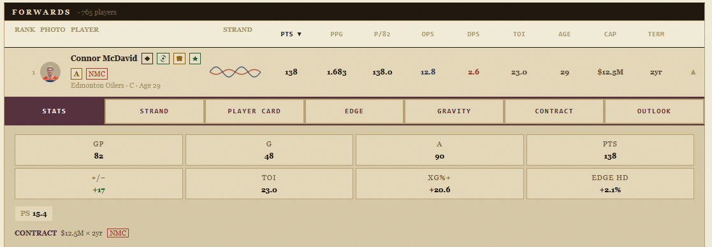
- [ ] **PA5 — STRAND:** retain core design; add player-compare dropdown. Make “What does each trait mean?” AA (darker, more readable). Improve labels such as `98%ile`. Standardize color meaning without making red ambiguously mean both low performance and defense. Add HD Finish and 20+ Bursts to definitions. Give each value context: denominator/meaning, league average, range/rank, and whether it is good (for example, `HD Finish 2.1%`, `681 20+ Bursts`). 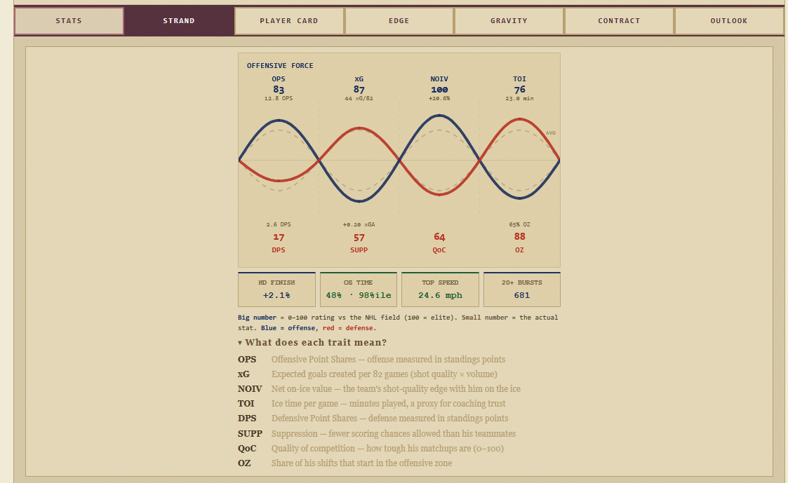
- [ ] **PA6 — Player Card/share:** export as a shareable image; move export logic here from GRAVITY. It must be free, highly readable, branded, and include proprietary analysis/projections. Use JFresh/Evolving Hockey only as competitive references. 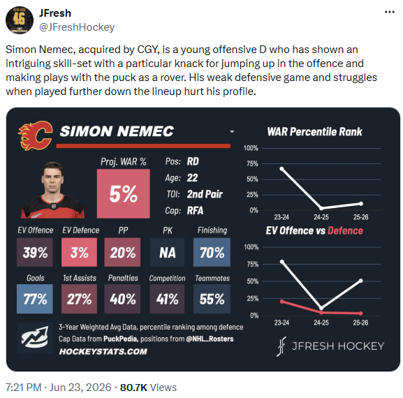 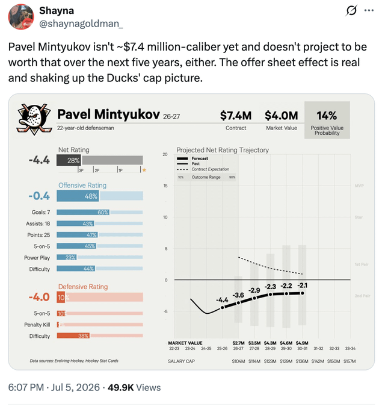
- [ ] **PA7 — Player Card design/data:** keep the current concept but make it more newspaper-like. Header background = FIG or paper; reserve INK for text. Spell out X-NAV for social viewers. Combine Cap Hit/FMV/Contract Surplus in one compact div; rename Market AAV → Fair Market Value. Validate suspiciously uniform “Percentiles vs All Forwards.” Retain Value Breakdown and Elite AVG Percentile. Add GRAVITY analysis plus EDGE DEF/NEUTRAL/OFF zone %, top speed, bursts, and hardest shot. Fix tooltip overflow. 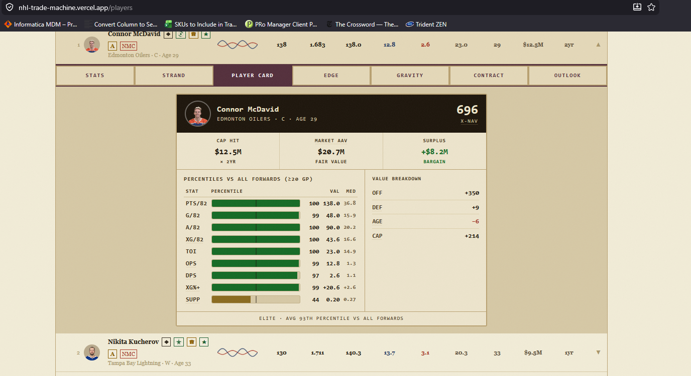 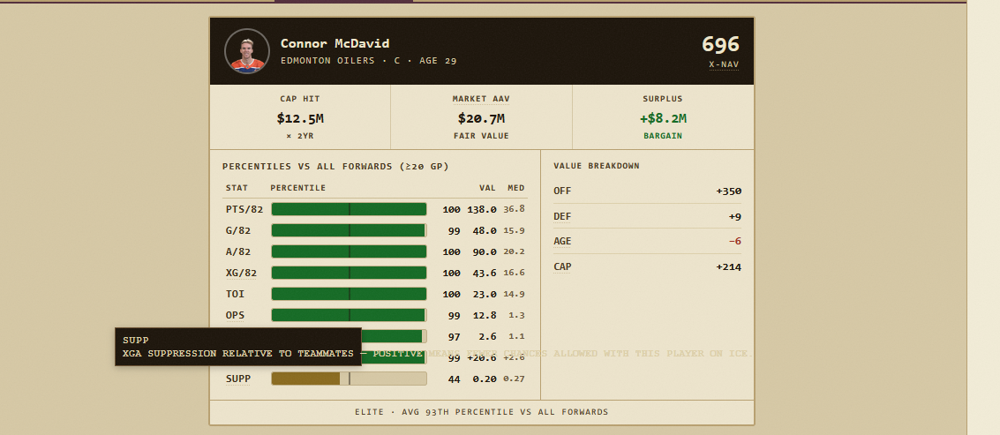
- [ ] **PA8 — Hot off the Press:** immediately generate cards for new contracts/extensions; show the latest five atop `/players` in a simple carousel/tab.
- [ ] **PA9 — EDGE:** make AA; show loading progress. 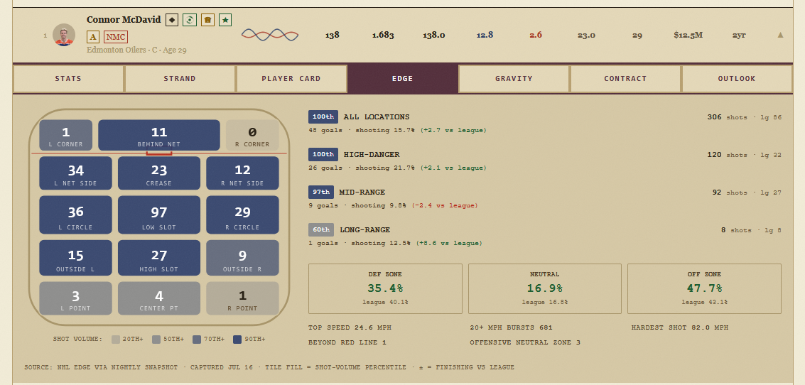
- [ ] **PA10 — GRAVITY:** make AA; use an existing off-white rink background; remove share card; ensure flag copy defines Supermassive, Transition Engine, etc.; define Main Sequence, Star, Black Hole, etc.; assess whether more useful metrics can be derived. 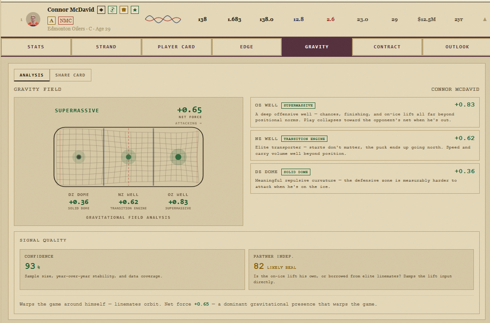
- [ ] **PA11 — Contract:** keep the concept but model Projected Next Contract using future cap/market at expiry, not today’s market. Test a possible McDavid `25x8` maximum scenario. 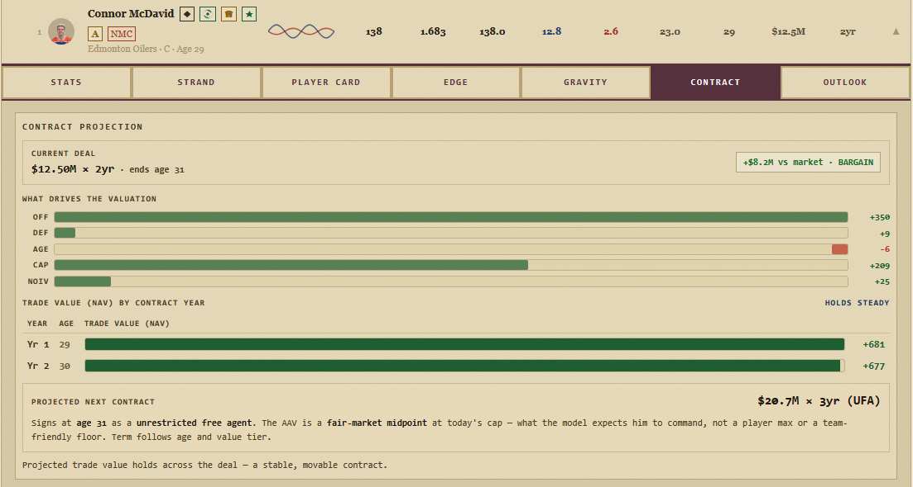
- [ ] **PA12 — Outlook:** current output is inaccurate/messy. Redefine its purpose and derive it from accumulated historical/current data, especially EDGE. 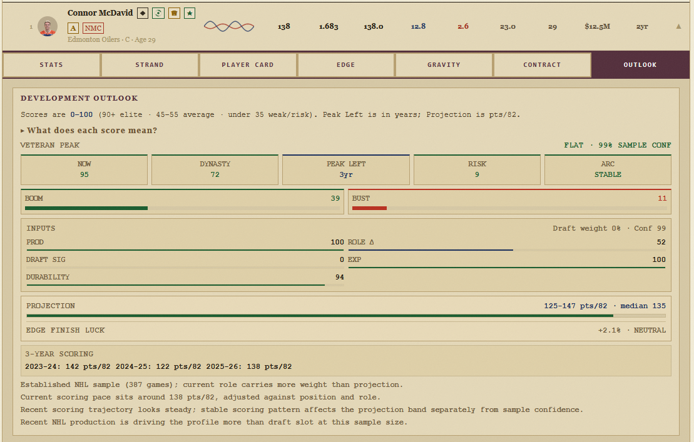

## 6. Docket

- [ ] **D1 — Ingestion:** overhaul the tedious trade-update backend. Preferred direction: ingest a CSV export of completed trades, iterate them, move assets, and correctly transfer draft picks.

## 7. Armchair GM

This needs a separate full audit; first fix:

- [x] **AG1 — UI:** Team Selection and Season Selection states must not use ink-black backgrounds.
- [x] **AG2 — Pick persistence:** traded picks must remain unavailable in the relevant future draft (for example, a traded 2027 first cannot still be selected in 2027).
- [ ] **AG3 — Position persistence:** alternative positions must persist into Lineups.
- [x] **AG4 — Player identity:** normalize/match diacritics so drafted players are removed and never duplicated (`Viggo Björck` vs `Viggo Bjorck`). 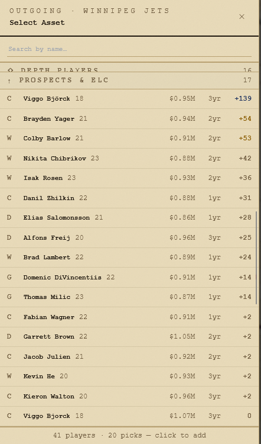
