# Armchair GM audit — 2026-07-23

Implementation backlog. Inspect the repo first. Done = code + regression tests. `AA` = WCAG 2.1 AA. Test a new run through Year 3.

## 1. State and season lifecycle

- [ ] **ST1 New run:** clear all prior sim state; restart at the 2026–27 offseason/2026 draft. Current bug: the old sim continues while only the draft resets.
- [ ] **ST2 Draft picks:** traded picks stay unavailable; completed draft years leave every asset selector. A traded 2027 first cannot reappear in that draft, and Year 2 cannot offer 2027 picks. 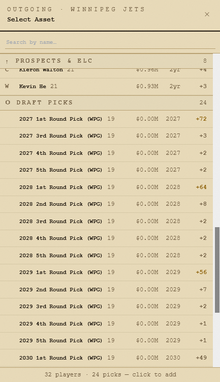
- [ ] **ST3 Positions:** alternative positions persist into Lineups. 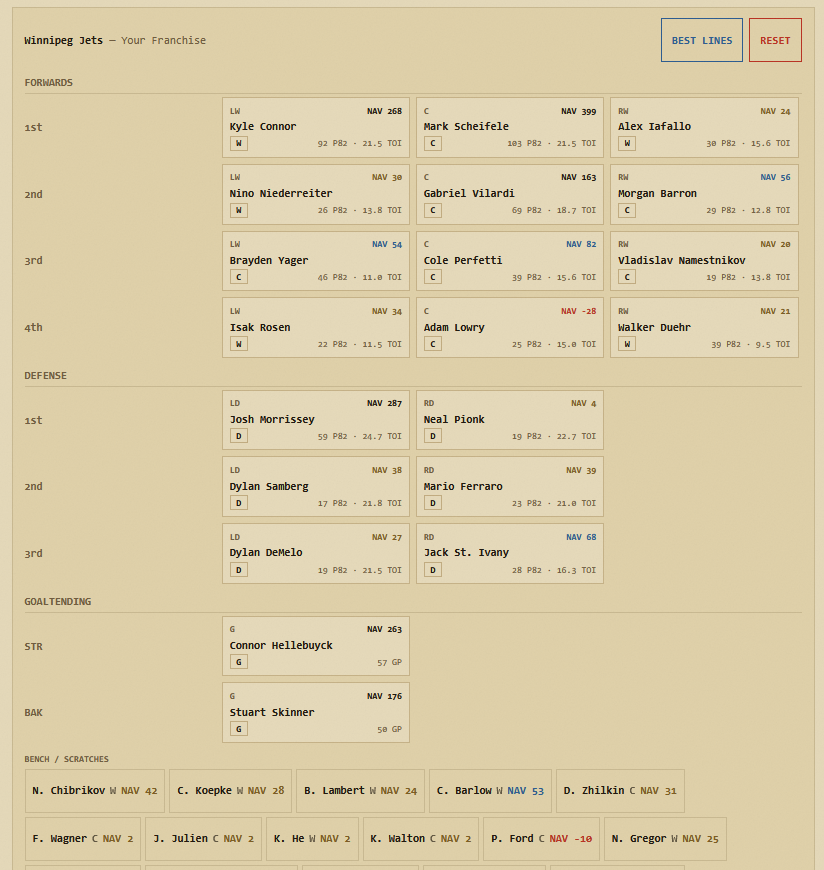

## 2. Roster, player cards, and lineups

- [ ] **RL1 Styling:** Team/Season Selection states cannot use ink-black backgrounds.
- [ ] **RL2 Roster:** add `ROSTER` before `LINEUPS`; sort by points; expand rows to current Stats/GRAVITY/Outlook/icons; refresh from the prior sim season. Replace `Team Numbers`. 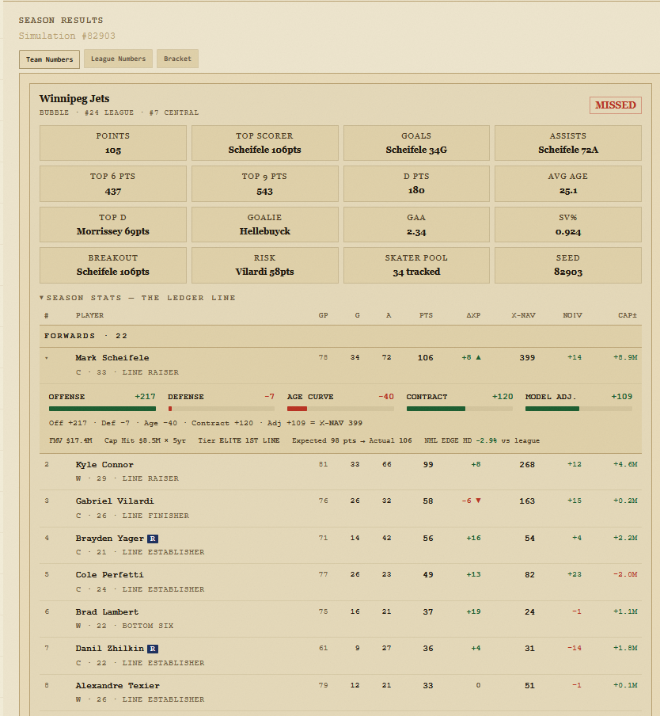
- [ ] **RL3 Cards:** update tabs/icons; remove `DEV`, add revamped Outlook and GRAVITY. 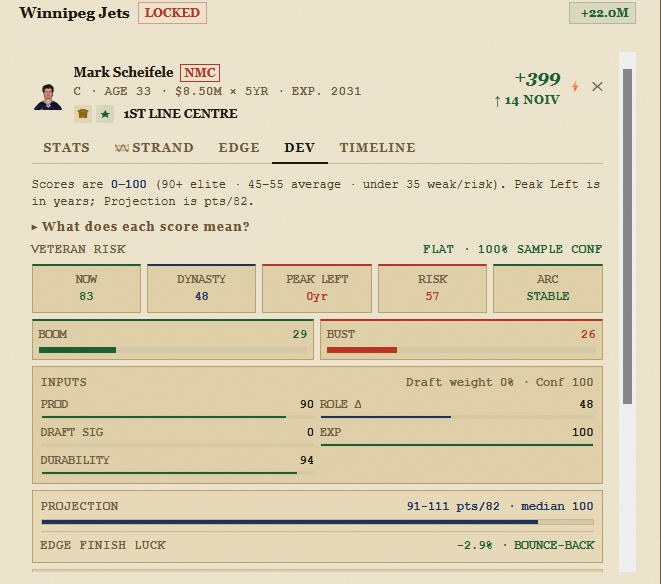
- [ ] **RL4 Leadership:** show Captain + two Alternate Captains from existing data.
- [ ] **RL5 Locks:** allow player-to-line locks.
- [ ] **RL6 Special teams:** add `5-on-5 | Power Play | Penalty Kill`; sim deployment must respect them.
- [ ] **RL7 Goalies:** generate backup sim stats.
- [ ] **RL8 Stats:** replace `P/82` with `G` and `A`. 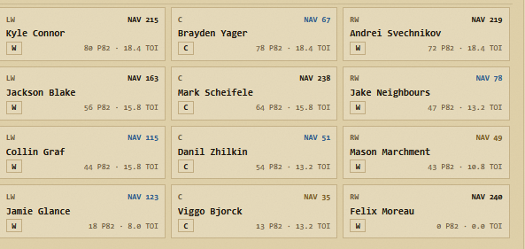

## 3. Valuation and data integrity

- [x] **VAL1 Prospect NAV:** Viggo Björck matching is fixed, but the eighth-overall pick has NAV `0`; fix. 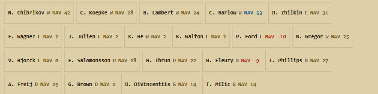 — the drafted "Viggo Björck" carried his context (draftOverall + NHLe pace) but collided with an accent-stripped seeded "Viggo Bjorck"; the old dedup dropped the drafted rookie, leaving the context-less copy to value at 0. `reconcileDraftedRookies` (`app/lib/draft-reconcile.ts`) now backfills the draft context onto the existing roster entry instead of dropping the rookie. Regression in `__tests__/draft-reconcile.test.ts`.
- [x] **VAL2 Duehr:** fix Walker Duehr’s inconsistent `3 GP/0 G/0 A/1 PTS`, unsupported second-line role, and inflated NAV. 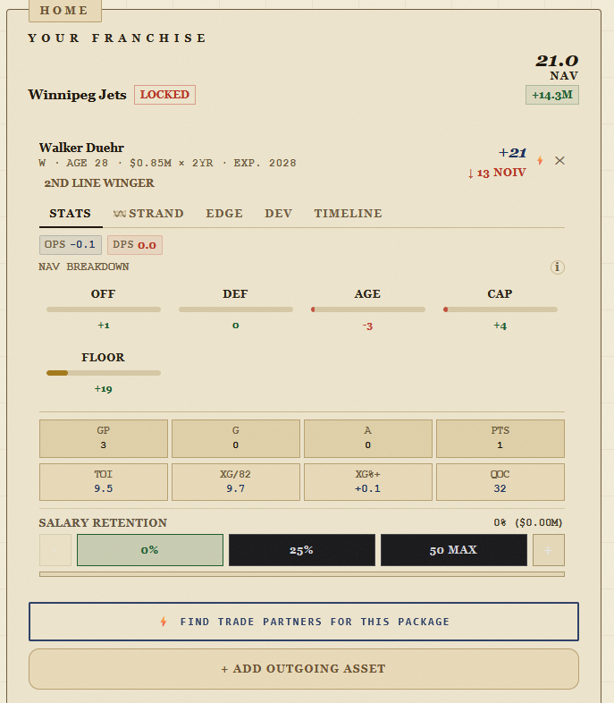 — (1) box score now derives PTS = G + A via `app/lib/box-score.ts` (independent per-pace rounding produced the 0-0-1 line); (2) a forward with < 15 NHL games now reads `UNPROVEN` instead of being handed a pace-driven `2ND LINE WINGER` role (`MIN_ROLE_SAMPLE_GAMES` in `AssetBadges.tsx`). The third sub-item — the ~+21 NAV — is the `REPLACEMENT_NAV` thin-sample anchor in the shared xnav core; deliberately left untouched (VAL3 already separated Duehr from Barkov, and changing the anchor has league-wide blast radius). Regression tests in `__tests__/box-score.test.ts`.
- [x] **VAL3 Relative value:** Duehr cannot equal Aleksander Barkov; add this regression test. 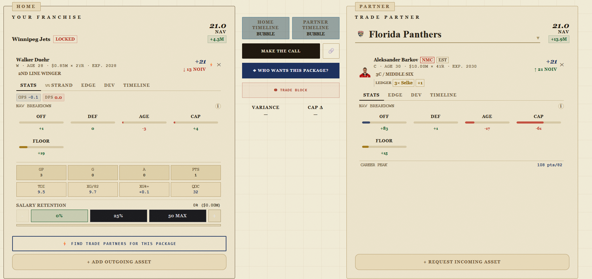 — resolved by VAL4: Barkov's pedigree floor now holds through his injury year, lifting him well clear of an unpedigreed depth callup. Regression in `__tests__/historical-floor-injury.test.ts`.
- [x] **VAL4 Injuries:** an injury-lost latest season cannot erase elite value. Use the most recent full season for Barkov-type cases. — `isInjuryShortenedPrime` in `player-data.ts`: for a pedigreed player still in his prime window (games < 55 && age ≤ peakAge+2), the depressed counting stats read as injury, not decline, so the historical floor keeps only its age decay and skips the games/pace collapse and the decline gate. A player past his peak with the same low sample is left to decay as before (Karlsson unchanged).

## 4. Offseason UX and transactions

- [ ] **OFF1 CTA:** after RFA, replace `Done — Proceed to Free Agency` with `Start Armchair GM` or the accurate next action. 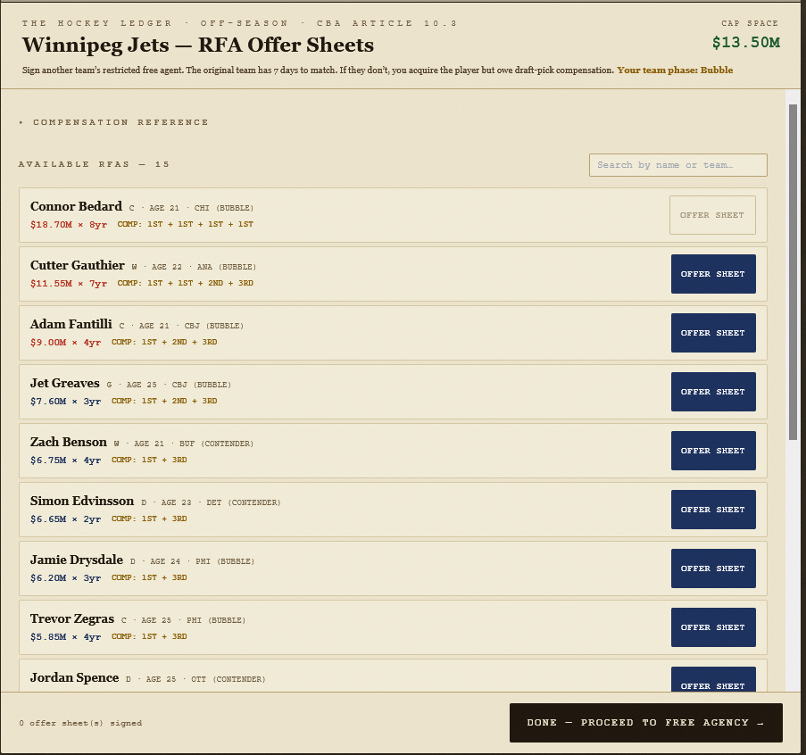
- [ ] **OFF2 Re-sign:** make the full screen AA. 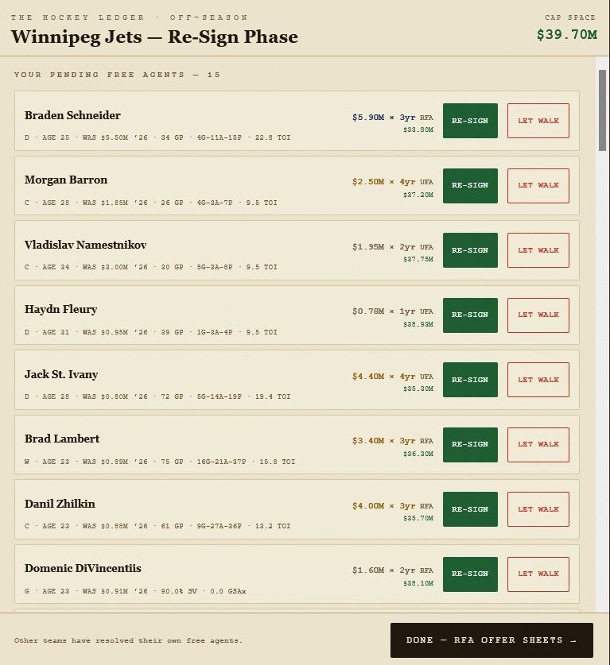
- [ ] **OFF3 Analytics:** enlarge the advanced-stat dropdown target; make expanded data AA; make offseason decisions more engaging/methodical. 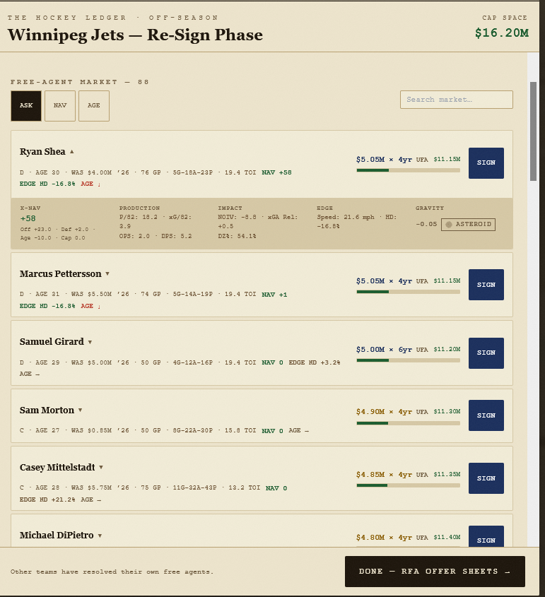
- [ ] **OFF4 RFA data:** match the FA expandable analytics.
- [ ] **OFF5 Extensions:** support human and AI extensions.
- [ ] **OFF6 FA pool:** `FA_POOL` is internal; never render/behave as a ghost team. 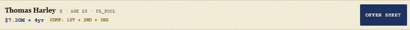
- [ ] **OFF7 AI trades:** allow realistic cap-clearing offseason trades using existing needs/trajectory/value logic; reject incoherent dumps.

## 5. AI cap management and player retention

- [ ] **AI1 Franchise RFAs:** retain foundational RFAs when feasible. San Jose cannot leave Celebrini unsigned or remove him from the sim. 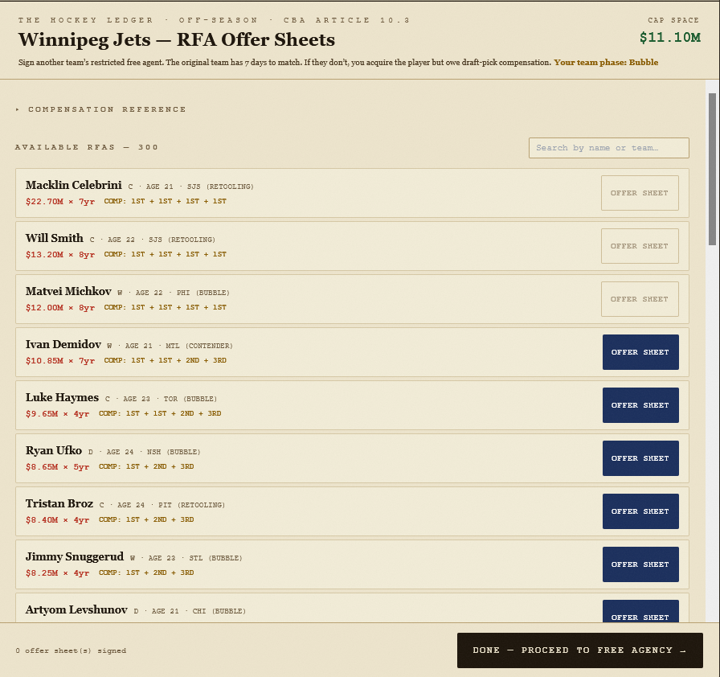
- [ ] **AI2 Cap priority:** fix Year 2 league-wide cap exhaustion. Reserve cap for priority RFAs before external UFAs; San Jose cannot sign Kucherov at Celebrini’s expense. 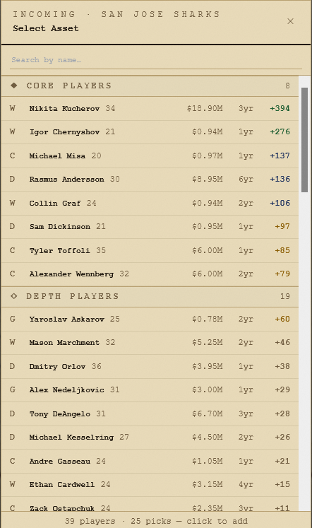
- [ ] **AI3 Player lifecycle:** nobody disappears between RFA/UFA/roster/market. Fix Year 3’s empty FA market and missing RFAs despite teams having `$5M+` cap. 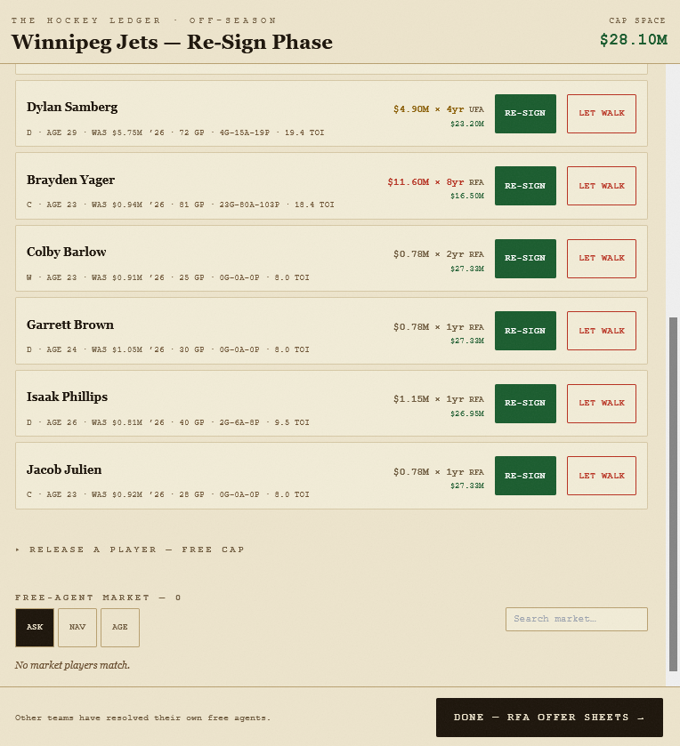

## 6. Simulation results

- [x] **SIM1 Bracket:** winners feed the correct next-round slot. Regression: Mammoth + Blackhawks wins must yield Mammoth–Blackhawks, not Wild–Blackhawks. 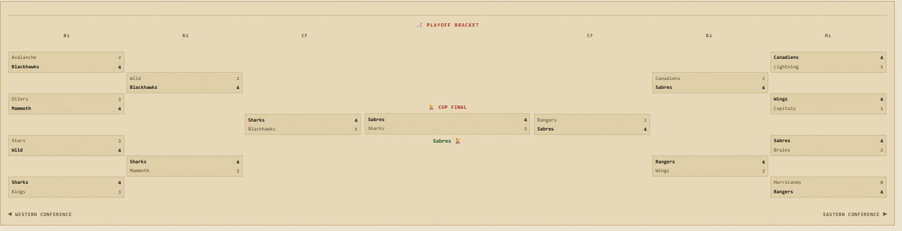 — bracket extracted to `app/lib/playoff-bracket.ts`; R2 now pairs adjacent R1 winners (rows 0+1, 2+3) instead of 0+2/1+3, so a winner feeds the slot drawn beside it. Regression in `__tests__/playoff-bracket.test.ts`.

---

## 7. Deep engineering audit (Codex, 2026-07-24)

State-integrity and correctness findings beyond the screenshot-level bugs above.
Some overlap fixes already shipped this session — marked inline. `Done = code + regression tests`.

### Release-blocking

- [ ] **CX1 URL hydration race:** the state→URL effect runs before the cold-load URL parser, so booting a default WPG partner can overwrite a shared query string before it's read. Add an explicit "URL hydrated" guard. `page.tsx:94/107/407`
- [ ] **CX2 Shared-link ownership:** shared URLs resolve assets globally by id with no ownership check — a crafted URL can move a third team's asset, and missing ids become zero-value fake picks that can be executed. `trade-share.ts:163`, `useTradeBench.ts:119`
- [ ] **CX3 Stale audit/memo/match responses:** changing a package clears the verdict but doesn't abort/version the in-flight evaluation; an old response can populate a verdict for a new package. Memos update whatever verdict exists; match results only clear on outgoing changes. (Related to but distinct from the Quick Trade fix already shipped.) `page.tsx:426/436/530/295`
- [ ] **CX4 executeTrade drops metadata + stale sim:** `setDb` returns only `{players, teams}`, dropping `capCeiling`/runtime metadata after the first trade (later NAV/audits revert to default cap — bad in Cup Run years). Execution clears the narrative but not `simData`. `useTradeBench.ts:177/193`, `useSimDispatch.ts:70`
- [ ] **CX5 Cup Run reset/restart universe:** `canStart` only needs a home team and start doesn't clear trades/sim (pre-run retained trades evade the retention ledger; a pre-run sim can count as a Cup season); rollover replaces `originalDb` so abandoning relabels Year 2/3 as Year 1; user-team cap is excluded from rollover reconciliation. `page.tsx:795`, `useCupRunLifecycle.ts:99/183`, `useTradeBench.ts:200`, `cup-run.ts:228`
- [ ] **CX6 RFA compensation pipeline:** letting a user RFA walk into the market lets the "Offer Sheet" button call plain `signMarketPlayer` (no compensation/matching); comp checks accept any owned pick of the right round regardless of year/owner; comp picks are deleted rather than transferred; original-team cap double-counts new+old contract; other teams' RFAs can be auto-re-signed yet still sit in the offer-sheet pool. `useOffseasonFlow.ts:147/213`, `ResignPhase.tsx:481`, `page.tsx:740`, `free-agency.ts:399`
- [ ] **CX7 Simulation cap + season context:** (a) ~~trade cap deltas use full cap hits, ignore retainedPct~~ **DONE** (Codex SIM #1, `effectiveCapHit`); (b) seed still includes partner selection (partner change rerolls a Cup universe) and omits roster identity — **PARTIAL** (Cup year + run seed now folded in, SIM #3); (c) Year 2/3 responses still identify as the static configured season and Claude is prompted to recap it. `route.ts:1124/1177`, `useSimDispatch.ts:97`, `claude/route.ts:319`
- [ ] **CX8 One canonical trade-value model:** the page's package compression subtracts slot penalties after summing (canonical engine clamps each marginal asset), so negative/low secondary players diverge between TugBar and verdict; pick-protection is a visible toggle that `calcPickNAV`/URL/execution/condition-resolution ignore (protected picks transfer unconditionally); cross-trade retention limits apply only in Cup Runs. `page.tsx:550`, `xnav-engine.ts:1147/339`, `AssetCard.tsx:528`, `useTradeBench.ts:94`

### High / moderate

- [ ] **CXH1 Analysis tab blanks:** `showSimPanel` prop is never used; executing from Compare/Breakdown clears blocks and leaves the active tab disabled with no content. `GmAnalysisTabs.tsx:105/209`
- [ ] **CXH2 Lineup state leaks + impurity:** reused `TeamLineup` keeps prior order across `teamId` change (no team key); swaps call setState inside another updater; `Cell` declared in render remounts each render; `resetTrades` clears goalies but not `lineupOrders`. `LineupEditor.tsx:148/215/238`, `useTradeBench.ts:200`
- [ ] **CXH3 Unsigned FA NAV disappears:** offseason resolution removes walked players from `db.players` while the NAV effect rebuilds `navMap` from current DB only — those market players show/sort as NAV 0. `useOffseasonFlow.ts:73`, `page.tsx:259`, `ResignPhase.tsx:182`
- [ ] **CXH4 Proposal generation cost/nondeterminism:** up to 36 full audits at concurrency 6; same-team alternatives share a fit score so the kept package depends on network order; failures vs "no viable partner" look identical. (capCeiling now passed — partial, from #7.) `TradeProposal.tsx:45/224/245`
- [ ] **CXH5 Partner Finder misclassification:** any cap-fitting result under score 60 becomes `CAP_CLEAR` (even 0); `LONG_SHOT` effectively only for tight cap; results are informational with no select/load action. `match/route.ts:230`, `MatchResultsPanel.tsx:130`
- [ ] **CXH6 Cap-floor validation asymmetric:** ceiling checked for both clubs; floor only for home team, static `SEASON.capFloor`, only when cap delta > $3M. `evaluate/route.ts:555/573`
- [ ] **CXH7 Analytics visuals disagree with models:** contention excludes <10-GP prospects and all picks despite being "future strength"; quadrant splits at 5/5 while classification uses 6.5/5.5; Team STRAND reference lines use averaged amplitudes not per-trait thresholds; ~~PlayerComparison "Avg TOI" summed~~ **DONE (#8)**, but it still uses skater metrics for goalies and linear (uncompressed) package NAV; a league-average EDGE value is colored red not neutral. `contention.ts:35/95`, `ContentionQuadrant.tsx:27`, `TeamStrand.tsx:194`, `PlayerComparison.tsx:163`, `TeamEdgeTiles.tsx:12`
- [ ] **CXH8 Accessibility partial:** team select, trade proposals, Cup prompts, draft night lack dialog semantics/focus-trap/initial-focus/Escape/restore; scroll lock omits memo + Cup resume; season rows mouse-only; tab decks use pressed buttons not tab semantics. (Overlaps OFF2/RL AA.) `TeamSelectModal.tsx:27`, `TradeProposal.tsx:325`, `page.tsx:184`, `SeasonResultsPager.tsx:247`
- [ ] **CXH9 Public API bounds:** ~~/api/simulate cast arbitrary JSON~~ **DONE (#4)**; `/api/match` still casts arbitrary JSON; `/api/evaluate` Zod has no array/string bounds or numeric constraints; `/api/claude` rate-limits before validating, allows large nested structures, no upstream timeout. `match/route.ts:36`, `evaluate/route.ts:115`, `claude/route.ts:379`

### Smaller UX / docs

- [ ] **CXS1** TeamSelectModal sorts its `teams` prop in place (mutates shared state). `TeamSelectModal.tsx:82`
- [ ] **CXS2** Draft Night says picks stay tradeable, but completion removes all current-year picks. `DraftNight.tsx:186`, `page.tsx:706`
- [ ] **CXS3** Offer Sheet completion says "Proceed to Free Agency" after FA/re-signing already happened. (Overlaps OFF1.) `OfferSheetPhase.tsx:369`
- [ ] **CXS4** Recap heading special-cases Edmonton, styling other teams differently. `SeasonResultsPager.tsx:136`
- [ ] **CXS5** Asset expiry uses the real calendar year, not the simulated Cup year. `AssetCard.tsx:132`
- [ ] **CXS6** Saved scenarios are read-only summaries (no restore/load); default partner alone enables saving an empty report. `TradeHistoryBar.tsx:165`, `scenarioStore.ts:16`

### Recommended execution order (Codex)
1. State integrity — CX1 URL guard, CX2 ownership, CX3 versioning, CX4 metadata-preserving setDb + sim invalidation.
2. Cup Run lifecycle — CX5 clean start, immutable Year-1 baseline, user-cap reconciliation, Year 1→3 integration tests.
3. Offseason/RFA — CX6 + cap/pick conservation tests.
4. Canonical compression/retention/pick rules everywhere — CX8, CX7c.
5. Rendered component tests + one full browser journey, then visual polish (CXH7, CXS).
